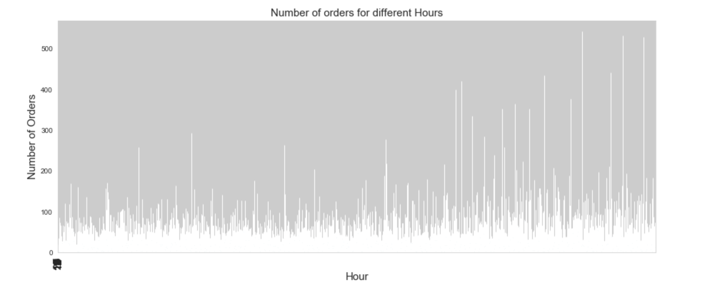
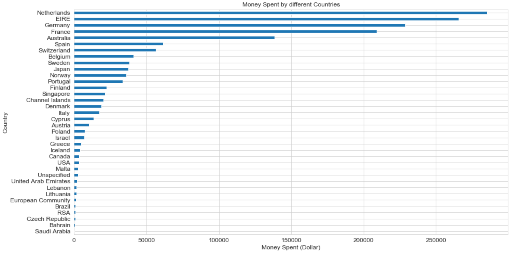

# Transaction-Analysis

A customer tempo analysis goes to the next level by incorporating transaction data into the scoring methodology to create improved scores that are a more accurate prediction of the customer’s propensity for certain behavior.

## Analysis Findings

### Hourly Trends

The company receives the highest number of orders at 12:00pm
Possibly most customers made purchases during lunch hour between 12:00pm - 2:00pm

### Weekly Trends

#### Finding: The number of orders received by the company tends to increases from Monday to Thursday and decrese afterward
#### Finding: There are no transactions on Saturday between 1st Dec 2019 - 9th Dec 2020

### Monthly Trends

####  Finding: November 2020 has the highest sales

### Country Patterns

### TOP 5 countries (including UK) that place the highest number of orders are as below:
1. United Kingdom
2. Germany
3. France
4. Ireland (EIRE)
5. Spain

#### Finding: The customer with the highest number of orders comes from the United Kingdom (UK)

### TOP 5 countries (including UK) that spend the most money on purchases are as below:

1. United Kingdom
2. Netherlands
3. Ireland (EIRE)
4. Germany
5. France
#### Finding : The customer with the highest money spent on purchases comes from Netherlands

### Outlier in analysis

The company tends to give out FREE items for purchases occasionally each month (Except June 2011)
However, it is not clear what factors contribute to giving out the FREE items to the particular customers
